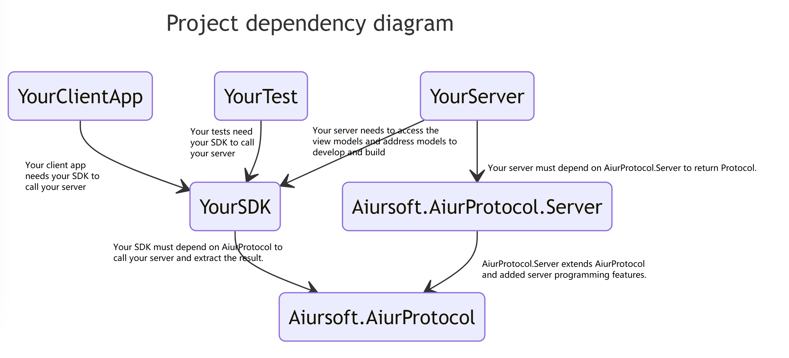

# AiurProtocol

[](https://gitlab.aiursoft.cn/aiursoft/aiurprotocol/-/blob/master/LICENSE)
[](https://gitlab.aiursoft.cn/aiursoft/aiurprotocol/-/pipelines)
[](https://gitlab.aiursoft.cn/aiursoft/aiurprotocol/-/pipelines)
[](https://www.nuget.org/packages/Aiursoft.AiurProtocol.Abstractions/)
[](https://www.nuget.org/packages/Aiursoft.AiurProtocol/)
[](https://www.nuget.org/packages/Aiursoft.AiurProtocol.Server/)

AiurProtocol defines an API programming practice to easily build a RESTful API. It simplifies the process of

* Auto HTTP request path building
* Strong-typed API model sharing
* Auto HTTP status code translation
* Auto error handling\error passthrough
* Auto input model validation\local validation
* Auto serialization and deserialization
* Document generation

And the API it built is also standard Restful HTTP API, so you can call it with any programming language.

With AiurProtocol, you can focus on designing your API and forget about those complications!

## Why this project?

API development is a challenging task that requires handling various aspects such as HTTP status codes, error handling, input validation, documentation writing, and log checking. However, this project aims to simplify the API development process by providing a unified best practice approach. By following this approach, developers can efficiently handle HTTP status codes, error handling, input validation, documentation writing, and log checking. This project's goal is to save time and effort, allowing developers to focus more on developing new features.

## Installation

Run the following command to install `Aiursoft.AiurProtocol.Server` to your ASP.NET Core project from [nuget.org](https://www.nuget.org/packages/Aiursoft.AiurProtocol.Server/):

```bash
dotnet add package Aiursoft.AiurProtocol.Server
```

Run the following command to install `Aiursoft.AiurProtocol` to your SDK project which sending requests to your server from [nuget.org](https://www.nuget.org/packages/Aiursoft.AiurProtocol/):

```bash
dotnet add package Aiursoft.AiurProtocol
```



## How to use on Server

Register AiurProtocol in your `Startup.cs`

```csharp
// Your startup.cs on server
using Aiursoft.AiurProtocol.Server;

public void ConfigureServices(IServiceCollection services)
{
    services
        .AddControllers()
        .AddAiurProtocol(); // <---- Add this after add controllers!
}
```

Now you can go to your Controller and return the protocol!

```csharp
// Your controller
using Aiursoft.AiurProtocol.Server;

public class HomeController : ControllerBase
{
    [Route("/api/hello-world")]
    public IActionResult Index()
    {
        return this.Protocol(Code.ResultShown, "Welcome to this API project!");
    }
}
```

## How to use it to build an SDK

Now you need to write an SDK for your API.

After creating a new class library project, add the dependencies:

```xml
<!-- Your SDK project file -->
<Project Sdk="Microsoft.NET.Sdk">

    <PropertyGroup>
        <TargetFramework>net7.0</TargetFramework>
        <ImplicitUsings>enable</ImplicitUsings>
        <Nullable>enable</Nullable>
    </PropertyGroup>
    <ItemGroup>
        <PackageReference Include="Aiursoft.AiurProtocol" Version="6.0.7" />
    </ItemGroup>
</Project>
```

Write the following method:

```csharp
// In SDK
using Aiursoft.AiurProtocol;
using Microsoft.Extensions.DependencyInjection;

public class DemoServerConfig
{
    public string Instance { get; set; } = string.Empty;
}

public class DemoAccess
{
    private readonly AiurProtocolClient _http;
    private readonly DemoServerConfig _demoServerLocator;

    public DemoAccess(
        AiurProtocolClient http,
        IOptions<DemoServerConfig> demoServerLocator)
    {
        _http = http;
        _demoServerLocator = demoServerLocator.Value;
    }

    public async Task<AiurResponse> IndexAsync()
    {
        var url = new AiurApiEndpoint(host: _demoServerLocator.Instance, route: "/api/hello-world", param: new {});
        var result = await _http.Get<AiurResponse>(url);
        return result;
    }
}

public static IServiceCollection AddDemoService(this IServiceCollection services, string endPointUrl)
{
    services.AddAiurProtocolClient();
    services.Configure<DemoServerConfig>(options => options.Instance = endPointUrl);
    services.AddScoped<DemoAccess>();
    return services;
}

```

## How to use your new SDK

Now you can write a new console app to use your new SDK to call your server!

```csharp
// To get your SDK:
var services = new ServiceCollection();
services.AddDemoService(endpointUrl);
var serviceProvider = services.BuildServiceProvider();
var sdk = serviceProvider.GetRequiredService<DemoAccess>(); // Or from dependency injection

// To use your SDK:
var result = await sdk?.IndexAsync()!;
```

That's it! It will use your SDK to generate a new call to your server, and the result is right at your hand!

## Advanced usage

* General
  * [HTTP Status code translation](./docs/http_status_code.md)
* API Design samples
  * [Custom routing](./docs/custom_routing.md)
  * [Call with HTTP parameter](./docs/http_get.param.md)
  * [Call with HTTP Post(Json)](./docs/http_post.json.md)
  * [Call with HTTP Post(Form)](./docs/http_post.form.md)
  * [Result paging](./docs/result_paging.md)
* Server Programming features
  * [Response complicated values](./docs/custom_response.md)
  * [Return expected error](./inop.md)
  * [Unexpected error](./inop.md)
  * [Input valid state checking](./inop.md)
* SDK Programming
  * [Error handling](./inop.md)
  * [Client side input validation](./inop.md)

## Future features

It will support the following features in the future:

* API rate limit
* API version control
* API documentation
* API request logging and report

## How to contribute

There are many ways to contribute to the project: logging bugs, submitting pull requests, reporting issues, and creating suggestions.

Even if you with push rights on the repository, you should create a personal fork and create feature branches there when you need them. This keeps the main repository clean and your workflow cruft out of sight.

We're also interested in your feedback on the future of this project. You can submit a suggestion or feature request through the issue tracker. To make this process more effective, we're asking that these include more information to help define them more clearly.
